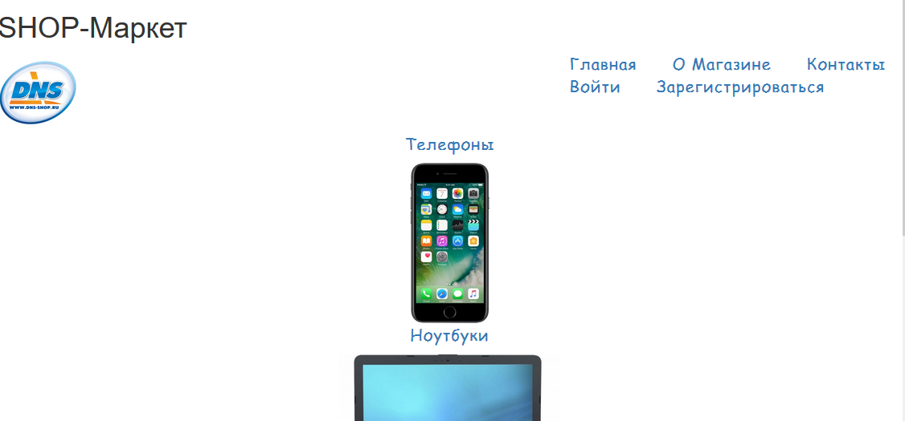
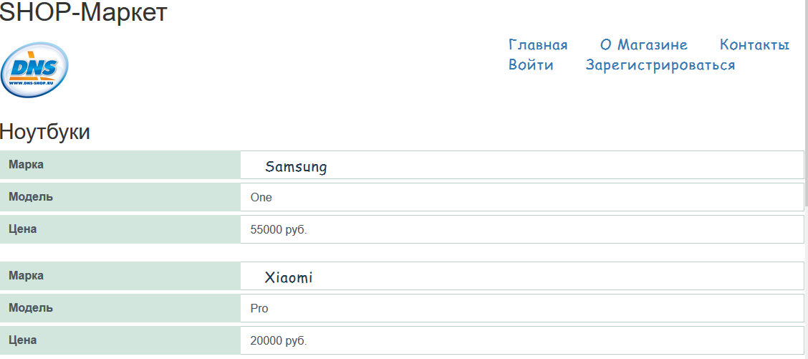
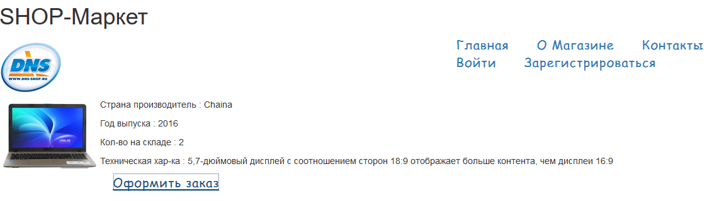
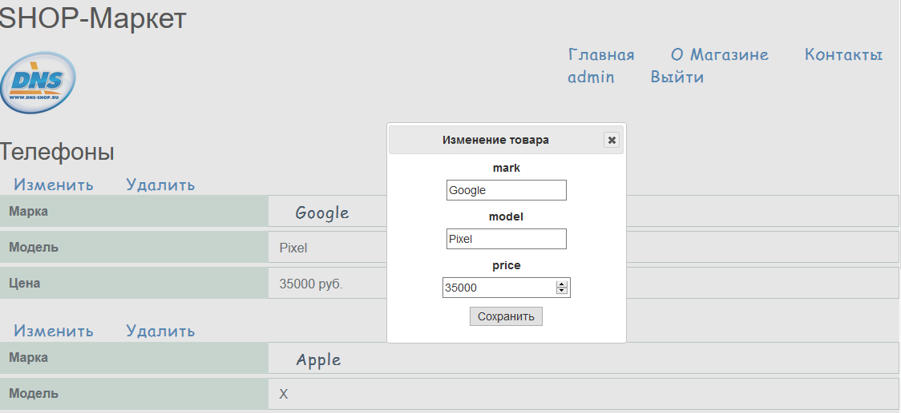

# FirstASP
>Главная страница сайта с категориями товаров

>При выборе категории отроется список товаров, относящихся к ней

>По нажатию ссылки открывается полная информация о товаре и возможность оформить заказ

>Окно с вводом информации для заказа

>Подтвержение принятия заказа

>Регистрация пользователя

>Неудачная попытка входа с неверным логином или паролем

>При входе с логином и паролем admin в списке товаров отображаются дополнительные возможности, которые позволяют изменять, удалять и добавлять информацию о товаре

>Аналогично с полной информацией

>При нажатии на ссылку с  логином  пользователя откроется список заказов, которые были оформленны на его почту, если вход был выполнен с аккаунта admin, то ему будут доступны заказы всех пользователей

